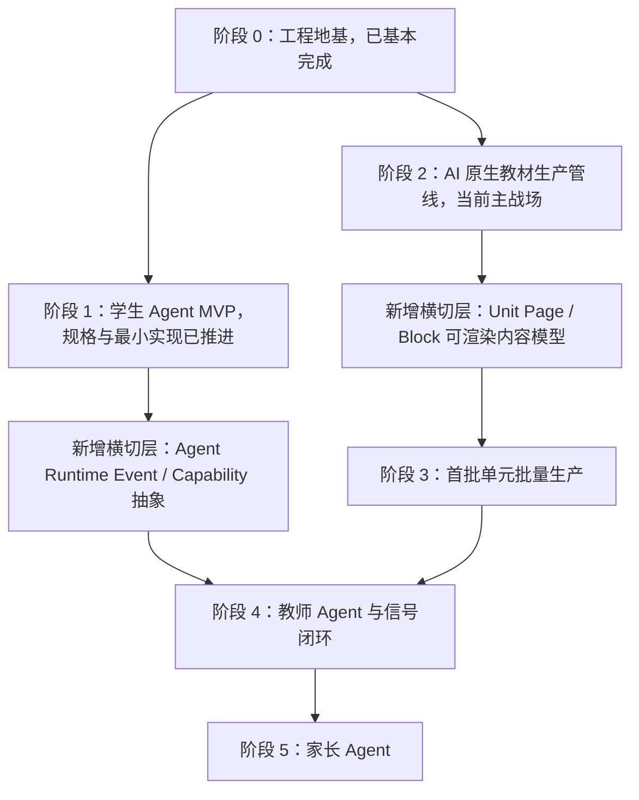

# DeepTutor 二次深读后的项目推进计划

版本：2026-04-25  
状态：当前自动化推进参照计划  
关联外部分析：`docs/external_references/DEEPTUTOR_INTEGRATION_ANALYSIS_2026-04-25.md`  
本次 DeepTutor 快照：`HKUDS/DeepTutor` main `c89a3df`，提交信息 `chore: prepare v1.2.4 release`

## 1. 二次理解结论

DeepTutor 不是一个应该被我们直接合并的“现成教育平台”，而是一个非常有价值的“Agent-native 学习系统参照样本”。

它真正给我们的启发有四个：

1. Agent runtime 不应是一堆散 prompt，而应拆为 `Tools + Capabilities + Unified Context + Stream Events`。
2. AI 原生教材不应只是 `unit.yaml` 文档，而应继续下钻到 `Book / Spine / Page / Block / Progress` 这样的可渲染学习对象。
3. 记忆系统必须给用户可见、可清除、可解释的入口；但 DeepTutor 的两文件记忆不适合未成年人学校场景，不能照搬。
4. Provider registry 可以参考它的多 provider 元数据管理，但我们必须增加 `purpose`、`privacy_level`、`provider_privacy_class`、成本追踪和 campus-local 强制路由。

最终取舍：

| 领域 | DeepTutor 可借鉴度 | 是否直接复用 | 我们的处理 |
| --- | --- | --- | --- |
| Tools + Capabilities | 高 | 否 | 在 `packages/agent-sdk` 用 TypeScript 重写 |
| Stream events | 高 | 否 | 设计 `AgentRuntimeEvent`，默认隐藏内部推理 |
| Book Engine | 很高 | 否 | 用于增强 Phase 2 Unit Spec 的 Page/Block 层 |
| Knowledge Hub / RAG | 中高 | 否 | 保留 pgvector、多租户和隐私桶过滤 |
| Memory | 中 | 否 | 借鉴 UX，不借鉴实现 |
| Provider Registry | 高 | 否 | 吸收 provider metadata 思路，加入隐私分级 |
| Next.js/Python 工程 | 低 | 否 | 不改变当前 Vue/Node/Postgres 主栈 |

## 2. 项目新总线

当前项目不需要推倒重来。新规划是在既有阶段 0/1/2 基础上加入 DeepTutor 启发出的两个横切层：



## 3. 当前状态判断

截至 2026-04-25：

1. 阶段 0：`0.1` 到 `0.6` 已形成完整地基，重点包包括 `shared-types`、`llm-gateway`、`memory-store`、后端骨架、CI 流程。
2. 阶段 1：学生 Agent 规格链路已推进到 `1.8`，具备 persona、记忆、知识图谱、掌握度、对话模式、隐私路由、学生 UI、内测流程的基本闭环。
3. 阶段 2：已升级为六角色 workflow：`subject_expert -> pedagogy_designer -> narrative_designer -> engineering_agent -> assessment_designer -> qa_agent`。
4. 阶段 2 当前瓶颈：真实 Zhipu `glm-5.1` 生成的候选 patch 被语义校验阻断，原因是节点引用漂移。这是正确的失败，不是坏事。
5. DeepTutor 二次分析带来的最重要改进：Phase 2 不能只产 `knowledge/pedagogy/narrative/implementation/assessment/quality`，还应产出可渲染的 `runtime_content.pages[].blocks[]`。

## 4. 接下来 6 个工程阶段

### E1：DeepTutor 启发的 Unit Runtime Content Spec

目标：在不改变现有 `unit.yaml` 主结构的前提下，新增可渲染内容层。

产出：

1. `docs/PHASE_2_5_RUNTIME_CONTENT_BLOCK_SPEC.md`
2. `packages/shared-types/src/content/ai-native-unit.ts` 扩展：
   - `RuntimeContentSection`
   - `UnitPage`
   - `UnitBlock`
   - `UnitBlockType`
   - `UnitBlockStatus`
   - `UnitSourceAnchor`
3. `content/units/math-g8-s1-linear-function-concept/unit.yaml` 增加最小 `runtime_content` 示例。
4. 测试覆盖：
   - block type enum 校验
   - source anchor 必填
   - target_nodes 必须引用存在节点
   - guardian/teacher 不可见 block 不能被错误标成跨角色可见

完工指标：

- `pnpm --filter @edu-ai/shared-types test` 通过。
- `pnpm --filter @edu-ai/content-pipeline test` 通过。
- `pnpm run ci` 通过。
- 语义校验能覆盖 `runtime_content.pages[].blocks[].target_nodes`。

复查重点：

- block 是否带 `visibility_scope`。
- AI 生成 block 是否带 `confidence_score` 和 `source_trace`。
- 互动/动画/code block 是否有安全沙箱标记。

### E2：Phase 2 语义修复闭环

目标：把真实 provider 候选被阻断后的修复流程从“手动看报告”推进为“机器生成修复请求 + 安全重跑”。

产出：

1. 对 `unknown_node_reference` 生成 role-scoped repair request。
2. 针对当前 `lf_slope_meaning` dangling reference，优先选择“保留核心 node id”或“全链路替换引用”的修复策略。
3. 修复策略不能直接写回 `unit.yaml`，必须产出 review artifact。

默认策略：

- 若核心种子图已定版，优先保留原 node id，要求 subject_expert 不得随意重命名核心节点。
- assessment_designer 必须引用现有节点，不能创造新节点。

完工指标：

- 修复后的 review artifact 通过 schema + semantic validation。
- 源 `unit.yaml` 不被自动覆盖。
- blocked artifact 能生成清晰的下一步执行请求。

复查重点：

- Agent 是否越权改 section。
- retry 是否绕过 semantic gate。
- 是否消耗真实 provider 调用；如需要真实调用，自动化应停下来提示。

### E3：Agent Runtime Event 抽象

目标：吸收 DeepTutor `StreamEvent`，为学生 Agent、教师日报、教材管线建立统一事件语言。

产出：

1. `AgentRuntimeEvent` 类型。
2. `AgentRuntimeEventType` 枚举：
   - `stage_start`
   - `stage_end`
   - `progress`
   - `tool_call`
   - `tool_result`
   - `source_anchor`
   - `content_delta`
   - `result`
   - `blocked`
   - `error`
   - `done`
3. 安全投影函数：
   - student view
   - teacher view
   - guardian view
   - admin/audit view

完工指标：

- 内部事件可以保留完整 trace。
- 学生/教师/家长前端只能拿到过滤后的 projection。
- 单测覆盖“thinking/internal metadata 不出现在 student/teacher/guardian projection”。

复查重点：

- 不能泄漏 raw prompt、raw output、raw student dialogue。
- `emotion` 类事件必须 campus-local only。

### E4：Content Block Planner 角色

目标：在 Phase 2 workflow 中新增或内嵌一个 Block Planner，把 `unit.yaml` 变成可渲染课程体验。

两种实现路径：

1. 轻量路径：先由 `engineering_agent` 负责 `runtime_content`。
2. 标准路径：新增 `block_planner` 角色，位于 `assessment_designer` 后、`qa_agent` 前。

默认建议：先走轻量路径，避免 workflow 角色继续膨胀；若后续 runtime_content 复杂度上升，再拆出 `block_planner`。

完工指标：

- 每个核心 learning_path step 至少有一个可渲染 block。
- 每个 assessment item 能映射到一个 quiz/practice block。
- block payload 只存结构化内容，不塞长篇不可解析 Markdown。

复查重点：

- 不要让 narrative_designer 写 UI payload。
- 不要让 block 失去 source_trace。

### E5：DeepTutor 非敏感 Spike

目标：用 DeepTutor 作为外部实验工具，验证它的 Book Engine 输出结构质量。

约束：

1. 只使用假课标、公开样例、无学生数据。
2. 不输入真实学生对话、家长信息、教师备注、情绪内容。
3. 不把 spike 输出直接并入生产源文件。

产出：

- `docs/external_references/DEEPTUTOR_SPIKE_REPORT_YYYY-MM-DD.md`

触发条件：

- 只有当 E1 的 runtime content spec 完成后，才值得跑 spike。

### E6：阶段 3 批量单元准备

目标：等 Phase 2 单元能够安全地产出 Page/Block 后，再进入初二数学批量单元。

产出：

1. 初二数学单元路线图。
2. 单元风格指南。
3. 课标/教材/误区库 source inventory。
4. 批量生产 backlog。

完工指标：

- 至少 3 个单元有 `metadata + knowledge skeleton + runtime_content skeleton`。
- 单元间 node id 和 prerequisites 不冲突。

## 5. 当前最高优先级队列

按无用户决策、低风险、最大推进价值排序：

1. `P0`：完成 E1 `Runtime Content Block Spec` 和 shared-types schema。
2. `P0`：扩展 semantic validator 覆盖 runtime content。
3. `P1`：更新示例 `unit.yaml`，加入最小 page/block。
4. `P1`：更新 Phase 2 自查文档，记录 DeepTutor 引发的 spec 增强。
5. `P1`：实现 role-scoped repair request 对 `unknown_node_reference` 的机器化输出。
6. `P2`：规划 DeepTutor 非敏感 spike，不实际运行真实学生数据。

## 6. 自动化推进原则

每次自动化醒来，应按以下顺序工作：

1. 读取 `docs/DEEPTUTOR_INFORMED_PROJECT_PLAN_2026-04-25.md`。
2. 读取 `docs/REVIEW_AND_SELF_CHECK_PROCESS.md`。
3. 读取最近的状态文档：
   - `docs/PHASE_0_STATUS_AND_NEXT_STEPS.md`
   - `docs/PHASE_1_STATUS_AND_NEXT_STEPS.md`
   - `docs/PHASE_2_4_AGENT_INVOCATION_CONTRACT_SELF_REVIEW.md`
   - `docs/PHASE_2_4_UNIT_SEMANTIC_VALIDATION_REPORT.md`
4. 选择最高优先级且不需要用户决策的任务执行。
5. 文件修改必须使用小步提交式变更，避免大范围重写。
6. 修改后运行最小相关验证；若触及核心 schema 或 content-pipeline，优先运行：

```powershell
pnpm --filter @edu-ai/shared-types test
pnpm --filter @edu-ai/shared-types typecheck
pnpm --filter @edu-ai/content-pipeline test
pnpm --filter @edu-ai/content-pipeline typecheck
```

7. 若改动跨包或 gate 相关，运行：

```powershell
pnpm run ci
```

## 7. 必须停下来的真实决策点

自动化不得擅自越过这些点：

1. 是否消耗真实 provider 调用，除非已有明确授权且当前任务只使用非隐私数据。
2. 是否把 DeepTutor 输出或代码直接并入生产源文件。
3. 是否改变主技术栈，如 Vue 改 React、Node 改 Python。
4. 是否修改隐私边界、可见性策略、教师/家长可见字段。
5. 是否把 blocked artifact 强行 approve 或写回 `unit.yaml`。
6. 是否使用真实学生、教师、家长、情绪、申诉数据做外部工具实验。

## 8. 自动化任务提示词

建议用于 10 分钟 heartbeat 自动化：

```text
继续推进 AI 时代新教育项目。每次醒来先读取 docs/DEEPTUTOR_INFORMED_PROJECT_PLAN_2026-04-25.md、docs/REVIEW_AND_SELF_CHECK_PROCESS.md 和当前阶段状态文档。优先执行不需要用户决策的最高价值工程任务，当前默认主线是 DeepTutor 启发的 Phase 2 runtime_content Page/Block 模型、shared-types schema、content-pipeline semantic validator、示例 unit.yaml 和自查文档同步。

执行纪律：
1. 不要改变主技术栈，不要直接并入 DeepTutor 代码。
2. 不要使用真实学生/教师/家长/情绪数据。
3. 不要把 blocked review artifact 强行 approve 或写回源 unit.yaml。
4. 不要擅自消耗真实 provider 调用；如果任务必须调用真实模型，停下来给出明确选项。
5. 修改文件前先确认相关 spec；修改后运行最小相关验证。
6. 若触及 shared-types，运行 pnpm --filter @edu-ai/shared-types test 和 typecheck。
7. 若触及 content-pipeline，运行 pnpm --filter @edu-ai/content-pipeline test 和 typecheck。
8. 若跨包或影响 gate，运行 pnpm run ci。
9. 每次结束简短汇报：完成内容、验证结果、残留风险、下一步。

真实决策点包括：真实模型调用、供应商/架构更换、隐私可见性变更、DeepTutor 代码直接引入、生产源 unit.yaml 写回、使用真实用户数据。遇到这些必须停下来等待用户确认。
```

## 9. 本轮下一步默认动作

自动化开启后，第一项应执行：

> 起草并实现 `PHASE_2_5_RUNTIME_CONTENT_BLOCK_SPEC`，把 DeepTutor 的 Page/Block 思想转化为我们自己的 `runtime_content` 结构，不引入 DeepTutor 代码，不调用真实模型。

验收：

- 新 spec 文件存在。
- shared-types 扩展或差距清单明确。
- 如实际改 schema，测试通过。

