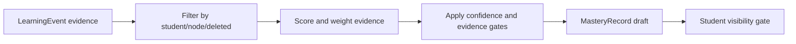

# Phase 1.4 Status and Phase 1.5 Next Steps

Version: 2026-04-22

## 1. Phase 1.4 Status

| Output | Status | File |
|---|---|---|
| Mastery evaluation spec | Implemented | `docs/PHASE_1_4_MASTERY_EVALUATION_SPEC.md` |
| Implementation report | Complete | `docs/PHASE_1_4_IMPLEMENTATION_REPORT.md` |
| Self review | Complete | `docs/PHASE_1_4_SELF_REVIEW.md` |
| Mastery evaluator | Complete | `packages/agent-sdk/src/mastery-evaluator` |
| Unit tests | Passed | `packages/agent-sdk/tests/mastery-evaluator.spec.ts` |
| Root CI | Passed | `pnpm run ci` |

Decision: Phase 1.4 is locked at 8.5. No P0/P1 issues remain.

## 2. What Phase 1.4 Enables

The project now has a testable bridge from event-sourced learning activity to materialized mastery state:

This is the key input for Phase 1.5 dialogue modes. The Student Agent can now ask: “What does the system currently believe about this node, and is that belief safe to use?”

## 3. Phase 1.5 Expected Work

Phase 1.5 should implement Mentor/Tutor dialogue mode contracts inside `@edu-ai/agent-sdk`.

Required outputs:

- `docs/PHASE_1_5_DIALOGUE_MODES_SPEC.md`
- A small dialogue policy module, likely under `packages/agent-sdk/src/dialogue-modes`
- Tests proving Mentor and Tutor respond differently to the same student intent
- Prompt/version metadata, even if the first version is deterministic and rule-based
- Guardrails that prevent both modes from violating `AGENT_PERSONA.md`

## 4. Phase 1.5 Completion Criteria

Phase 1.5 can be locked when:

- Mentor mode does not directly solve/complete work for the student by default.
- Tutor mode can answer clearly when the student explicitly asks for direct help.
- Both modes cite safe mastery/knowledge context without exposing raw evidence.
- Both modes respect low-confidence and visibility gates.
- Both modes preserve emotional/privacy route signals for Phase 1.6.
- Tests cover at least one same-input/different-mode behavior pair.

## 5. Phase 1.5 Review Focus

- Does Mentor mode accidentally become answer-giving?
- Does Tutor mode accidentally become homework代写?
- Does either mode expose low-confidence mastery, teacher-only notes, or raw memory?
- Are mode changes explicit rather than hidden?
- Are prompt/policy versions traceable for later regression tests?

