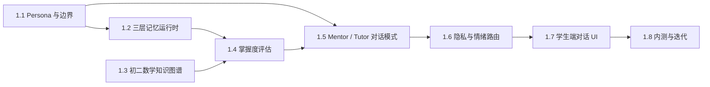

# Phase 1 Status and Next Steps

版本：2026-04-22

## 一、阶段 1 定位

阶段 1 的目标是做出学生 Agent MVP：单学科、单年级、做深不做广。当前推荐目标仍为初二数学，因为学习效果更容易量化，也更容易让校长、老师和家长理解价值。

阶段 1 的主链路：

## 二、1.1 当前状态

| 产出 | 状态 | 文件 |
|---|---|---|
| Phase 1.1 Spec | 已起草 | `docs/PHASE_1_1_AGENT_PERSONA_SPEC.md` |
| Student Agent Persona | 已起草 | `docs/AGENT_PERSONA.md` |
| 工程自查 | 已完成 | `docs/PHASE_1_1_SELF_REVIEW.md` |
| 种子老师评审 | 待人工执行 | 需 2 名老师反馈 |

当前 Codex 可交付状态：内部 8.5 可评审草案。  
最终锁定状态仍需要种子老师反馈和治理开放项决策，因为人格边界、Red 高危接收人和课堂接受度不是纯工程判断。

## 三、1.1 完工指标

| 指标 | 当前状态 |
|---|---|
| 人格定位清楚 | 已完成 |
| 称呼方式清楚 | 已完成 |
| 能做 / 不做清单清楚 | 已完成 |
| Mentor / Tutor 模式边界清楚 | 已完成 |
| 情绪升级流程清楚 | 已完成 |
| InterAgentSignal 不传原始内容 | 已完成 |
| 种子老师评审问题 | 已完成 |
| `pnpm run ci` | 已通过 |
| 外部老师 2 人确认 | 待人工执行 |

## 四、进入 1.2 的建议条件

建议满足以下条件后进入 1.2 三层记忆运行时：

1. `docs/AGENT_PERSONA.md` 经过本地自查，无 P0/P1。
2. `pnpm run ci` 通过。
3. 若暂时没有老师评审，可先进入 1.2 技术 Spec，但不要锁定最终 prompt。
4. 任何新增记忆字段必须能回答“是否符合 Persona 的记忆边界”。

## 五、1.2 预期任务

阶段 1.2 应把阶段 0.4 的 memory-store 从基础包推进到 Student Agent 可用的三层记忆运行时：

1. Working Memory：当前会话最近 N 轮。
2. Episodic Memory：会话结束后的异步摘要，按 academic / emotional / personal 三桶隔离。
3. Semantic Memory：每周更新的学生稳定画像，支持版本、可见、解释和删除请求。
4. 删除权：学生可申请删除普通记忆。
5. 透明性：学生能看到系统记住了什么。

复查重点：

1. emotional bucket 是否仍然 campus-local only。
2. teacher_agent 是否只能召回 academic 摘要。
3. 学生删除后是否仍被用于个性化。
4. 低置信度内容是否被挡在长期画像之外。

## 六、1.2 当前状态

| 产出 | 状态 | 文件 |
|---|---|---|
| Phase 1.2 Memory Runtime Spec | 已起草 | `docs/PHASE_1_2_MEMORY_RUNTIME_SPEC.md` |
| Phase 1.2 Implementation Report | 已起草 | `docs/PHASE_1_2_IMPLEMENTATION_REPORT.md` |
| Phase 1.2 Self Review | 已更新 | `docs/PHASE_1_2_SELF_REVIEW.md` |
| Phase 1.2 Independent Review | 已完成替代冷审并修复 P1/P2 | `docs/PHASE_1_2_INDEPENDENT_REVIEW.md` |
| 实现落点建议 | 已给出 | 推荐 `packages/agent-sdk/src/memory-runtime` |
| 工程实现 | 已完成最小实现 | `packages/agent-sdk/src/memory-runtime` |
| 定向验证 | 已通过 | `memory-store` / `agent-sdk` typecheck + test |
| CI 门禁 | 已通过 | `pnpm run ci` |

当前判断：1.2 替代冷审发现的 P1/P2 已修复，根目录 `pnpm run ci` 已通过，可按 8.5 锁定并进入 1.3。

## 七、1.3 预期任务

阶段 1.3 应把“初二数学知识图谱”从愿景拆成可执行的内容规格与首批节点计划：

1. 定义知识图谱作者侧结构和运行时实体映射。
2. 规定 `KnowledgeNode`、`Unit`、`LearningPath`、`Assessment` 的连接方式。
3. 先选一个试点单元，如“一次函数的概念”，定义 8-12 个核心节点作为种子图。
4. 明确节点必须包含课标对齐、掌握标准、常见误区、典型任务和评估探针。
5. 明确 prerequisites 边必须无环，核心节点不得孤立。
6. 明确内容层不含学生隐私，运行时只引用 node id。

复查重点：

1. 是否会把内容图谱和学生掌握度记录混在一起。
2. 节点 ID、课标条目、评估题目是否能被后续 MasteryRecord 使用。
3. 误区描述是否足够具体，能被 Student Agent 在对话中引用。
4. 是否有过度宽泛、不可测的节点。
5. 未来 4-Agent 教材管线是否能复用本规格。

## 八、1.3 当前状态

| 产出 | 状态 | 文件 |
|---|---|---|
| Phase 1.3 Knowledge Graph Spec | 已起草 | `docs/PHASE_1_3_KNOWLEDGE_GRAPH_SPEC.md` |
| Phase 1.3 Self Review | 已完成 | `docs/PHASE_1_3_SELF_REVIEW.md` |
| Phase 1.3 Independent Review | 已完成首轮替代冷审并修复 P1 | `docs/PHASE_1_3_INDEPENDENT_REVIEW.md` |
| Unit Spec 入口 | 已同步 | `docs/UNIT_SPEC.md` |
| MVP Seed Graph | 已起草 | `content/units/math-g8-s1-linear-function-concept/knowledge-graph.seed.json` |
| Knowledge Graph Validator | 已通过 | `pnpm run validate:knowledge-graph` |
| CI 门禁 | 已通过 | `pnpm run ci` |
| 第二轮替代冷审 | 子代理连续超时，已关闭 | 改用主线程严格复核 |

当前判断：1.3 已完成 Spec 草案、作者侧种子图和增强 validator；首轮替代冷审发现的 P1 已修复，validator 与根目录 CI 已通过。第二轮替代冷审因子代理连续超时未完成，已采用主线程严格复核替代补审；当前无 P0/P1 残留，可按 8.5 锁定并进入 1.4。

## 九、1.4 预期任务

阶段 1.4 应基于 1.3 知识图谱实现掌握度评估机制：

1. 定义 `LearningEvent` 到 `MasteryRecord` 的聚合规则。
2. 区分事件溯源事实和掌握度物化视图。
3. 定义 evidence_count、confidence、decay_factor、next_review_recommended_at。
4. 低置信度不入档，学生展示必须检查 `is_visible_to_student`、`is_acceptable_to_record`、`visibility_scope`。
5. No-AI baseline 应作为高权重证据。
6. 评估结果必须可解释、可追溯、可申诉。

复查重点：

1. 是否把单轮对话直接当成稳定掌握度。
2. 是否绕过 1.3 的 node id。
3. 是否错误展示低置信度或 teacher-only 记录。
4. 是否有可测试的样例事件和预期 mastery 输出。
5. 是否为阶段 1.5 Mentor/Tutor 模式提供可靠上下文。
