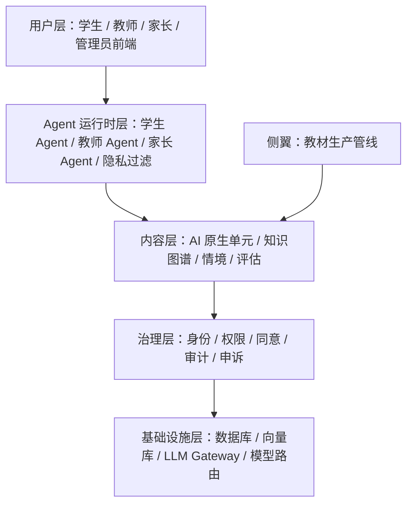
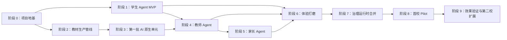

# AI 原生教育平台工程执行总规

版本：2026-04-26
状态：当前权威执行手册；2026-04-26 起以 rebase 规划和新增闸门作为最新执行补充

最新补充入口：

- `docs/PROJECT_MASTER_PLAN_REBASE_2026-04-26.md`
- `docs/PROJECT_REBASE_EXISTING_WORK_AUDIT_2026-04-26.md`
- `docs/EXTERNAL_STANDARDS_ADAPTER_SPEC.md`
- `docs/VOICE_RUNTIME_SPIKE_SPEC.md`
- `docs/CURRICULUM_DESIGN_IMPORT_CONTRACT.md`
- `docs/CONTENT_PACKAGE_MANIFEST_SPEC.md`
- `docs/MISCONCEPTION_FEEDBACK_ROUTE_SPEC.md`
- `docs/CLASSROOM_ACTION_PLAN_SPEC.md`
- `docs/SAFE_EXECUTION_CONTRACT_COMPACTION_ADR.md`
- `docs/GITHUB_EDTECH_REFERENCE_RADAR_2026-04-26.md`
- `docs/OPENMAIC_DEEP_DIVE_AND_INTEGRATION_PLAN_2026-04-26.md`

## 1. 项目再定义

这个项目不是普通 AI 辅导工具，而是面向私立学校实验班的 AI 原生教育操作系统。它同时包含四条主线：

1. 学生侧：长期陪伴、有记忆、有边界的 AI 学伴。
2. 教师侧：能看见班级全貌、尊重隐私、放大教师能力的 AI 助手。
3. 内容侧：AI 原生教材，不是把旧课本喂给 AI，而是重新设计适合 AI 时代的学习单元。
4. 治理侧：身份、权限、同意、审计、申诉、隐私过滤贯穿运行时。

五层架构：



## 2. 当前内容管线口径

工程实现层面，Phase 2 内容管线当前使用五个生产专家加一个 QA Gate：

```text
subject_expert -> pedagogy_designer -> narrative_designer -> engineering_agent -> assessment_designer -> qa_agent
```

外部叙事中可以继续把它称为“AI 教材生产管线”，但工程执行、测试、artifact 计数、mock invocation 计数必须按六个 workflow roles 处理。

## 3. 阶段依赖



关键判断：

- 阶段 0 是硬地基；没有 shared-types、monorepo、LLM Gateway、向量记忆和后端骨架，后续模块会重复造轮子。
- 阶段 1 和阶段 2 可在阶段 0 后并行推进。
- 阶段 4 不能早于阶段 1；教师 Agent 依赖学生 Agent 产生可信信号。
- 阶段 3 不能早于阶段 2；内容批量生产必须先有可复用管线。
- 阶段 8 不能早于阶段 7；真实学校部署前，治理能力必须进入运行时。

## 4. 全局工程闸门

每个阶段必须经过同一套闸门：

| Gate | 名称 | 通过条件 |
| --- | --- | --- |
| Gate A | Spec Ready | 目标、非目标、数据结构、权限边界、完工指标写清楚 |
| Gate B | Implementation Ready | 目录、依赖、测试方式、回滚方式明确 |
| Gate C | Local Verified | 类型检查、测试、构建或脚本验收通过 |
| Gate D | Governance Check | 谁能看、谁能改、是否留痕、是否可能泄漏隐私已检查 |
| Gate E | Cross Review | Claude Code 复核；Claude 不可用时使用独立 Codex 子代理 + 主线程证据审计 |
| Gate F | Locked | Gap 修复完成，评分达到 8.5 或以上，可进入下一阶段 |

评分约定：

- 8.5：可定版，允许进入下一阶段。
- 8.0：方向正确但有中等 Gap，必须修复后再定版。
- 7.5：结构可用但一致性或范围有明显缺口。
- 低于 7.5：不能进入实现，先回到 Spec。

## 5. 阶段完工指标

| 阶段 | 核心目标 | 必须产出 | 完工指标 | 复查重点 |
| --- | --- | --- | --- | --- |
| 0.1 数据模型 | 统一全系统实体语言 | `packages/shared-types`、Zod schema、测试、报告 | 类型检查通过，schema 测试通过，前端可导入 | 隐私字段、InterAgentSignal、事件溯源、枚举完备 |
| 0.2 Monorepo | 统一工程组织 | pnpm workspace、Turborepo、迁移后的 governance 前端 | 一次 install，统一 build，全绿，无前端回归 | 路径迁移、依赖边界、脚本一致性 |
| 0.3 LLM Gateway | 统一模型入口 | Gateway SDK、prompt 版本、成本记录、路由规则 | 至少 3 类模型路由可模拟，隐私路由可测 | 不允许业务代码直连模型 |
| 0.4 向量记忆 | 建立长期记忆检索 | pgvector 表、embedding 写入与召回、隐私分桶 | 文本可写入和召回，情绪桶不可跨 Agent | 情绪记忆隔离 |
| 0.5 后端骨架 | 从 mock 走向真实 HTTP | Node 后端、认证、CRUD、OpenAPI、审计 | 前端切 HTTP 零回归，烟雾测试通过 | 审计落库、错误格式、鉴权 |
| 0.6 测试 CI | 建立持续验证 | Vitest、Playwright、GitHub Actions、评审流程 | PR 自动跑 lint/typecheck/test/build | CI 是否阻止坏代码合并 |
| 0.7 外部标准适配 | 让系统可对接 xAPI/LRS、H5P、Kolibri/content package 等外部生态 | 外部标准适配 Spec、导出/导入边界、许可证与隐私闸门 | 外部标准只作为 projection/adapter，不污染内部 `LearningEvent`、`Unit`、`RuntimeEvent` 主模型 | 许可证、数据最小化、隐私导出、外部运行时隔离 |
| 1 学生 Agent | 做出可长期使用的 AI 学伴 | Persona、记忆、知识图谱、掌握度、对话 UI | 14 天内测，有连续感，情绪路由安全 | 人格边界、学科正确性、学生体验 |
| 1.7B 语音 Runtime Spike | 验证实时语音伴学是否构成体验优势 | 语音 Spike Spec、合成数据脚本、延迟指标、降级路径 | 只用合成/假名数据完成 VAD/STT/隐私路由/Agent/TTS 端到端方案；不落地真实学生音频 | 原始音频不留存、情绪语音 campus_local_only、教师/家长不可听回放 |
| 2 教材管线 | 建立能造教材的工厂 | Unit Spec、六角色 workflow、RAG 资源 | 端到端产出一个合格单元 | 课标对齐、教学法、对话质量、评估质量 |
| 3 内容批量 | 批量产出第一批单元 | 初二数学单元库、风格指南、试用反馈 | 一学期 80% 覆盖，满意度基线建立 | 跨单元一致性 |
| 4 教师 Agent | 让老师愿意每天用 | Teacher Spec、信号协议、日报、干预流程、控制台 | 种子老师每天读日报，3+ 干预流程可用 | 只传信号不传内容 |
| 5 家长 Agent | 家校闭环但不过度控制 | 家长周报、同意书、申诉、家长 UI | 家长周打开率目标 80% | 不制造焦虑，不展示隐私细节 |
| 6 体验打磨 | 从能用到好用 | 三端体验优化、设计系统、性能和无障碍 | UX 评审通过，用户满意度达标 | 移动端、加载态、错误态 |
| 7 治理运行时 | 把治理嵌入真实流程 | 置信度门禁、审计链、申诉状态机、同意生命周期 | 外部渗透测试通过 | 可追责、可导出、可申诉 |
| 8 首校 Pilot | 真实实验班运行 | 合同、培训、基线、软启动、运行机制 | 一学期稳定运行，0 重大未处理事件 | 组织流程和应急机制 |
| 9 扩展准备 | 证明效果并复制 | 效果报告、产品化手册、第二校 LOI | 对外报告完成，第二校准备就绪 | 数据可信度和商业叙事 |

## 6. 2026-04-26 新增执行闸门

这些闸门来自 DeepTutor、OpenMAIC、Oppia、Kolibri、H5P、xAPI/LRS、实时语音和 AI 原生课程设计方向的重新校准。它们不替代原 Gate A-F，而是作为进入实现前的额外止损线。

### 6.1 外部代码与许可证闸门

- 默认策略：只学习架构、数据结构、交互范式和评审机制，不直接并入外部仓库代码。
- 任何外部代码、prompt、数据、组件或配置进入仓库前，必须先记录来源、许可证、用途、替代方案和最小引入范围。
- AGPL、未知许可证、商业不明、数据集授权不明、学生数据来源不明的材料，一律视为真实决策点，必须停下来给用户选项。
- 即使许可证允许，也要优先采用“参考后自研 adapter/contract”的方式，避免把外部项目的运行时、存储模型或治理假设带入内部核心模型。

### 6.2 外部标准适配闸门

- xAPI/LRS、H5P、Kolibri/content package 只能作为导入、导出或包分发 adapter。
- 内部事实源仍然是 `LearningEvent`、`AiNativeUnitSpec`、`AgentRuntimeEvent` 和 review artifact。
- 任何 adapter 不得扩大教师、家长或外部系统可见字段；导出前必须经过数据最小化和隐私 deny-list。
- 外部标准字段缺失时，允许生成 lossy projection，但必须在 manifest 中标记不可逆和缺失语义。

### 6.3 语音运行时隐私闸门

- 语音 Spike 阶段只允许合成语音、假名学生、伪造课堂场景，不允许真实学生、真实老师或真实情绪语音。
- 原始音频默认不落库；转写文本只保留完成学习事件所需的最小片段。
- 情绪、身份、自伤、家庭冲突等敏感语音路径必须 `campus_local_only`，不得走云端或聚合平台。
- 教师和家长只能收到结构化信号和建议动作，不得回放学生原始语音或查看原始敏感转写。

### 6.4 课程设计导入闸门

- 课程设计新对话的产物不得直接写入生产 `unit.yaml`。
- 合法路径是：课程设计稿 -> `CurriculumDesignImportDraft` -> schema 校验 -> 语义校验 -> review artifact -> 人工确认 -> 显式 apply。
- 导入内容必须同时覆盖学生侧学习材料、教师侧课堂组织、AI 互动脚本、学习任务/能力认证、证据采集、隐私边界和课堂 fallback。
- blocked review artifact 只能打开修复任务或人工队列，不得被强行 approve。

### 6.5 大规模重构闸门

- Monorepo、shared-types、content-pipeline、运行时事件模型等核心路径做大规模迁移前，必须先有备份/回滚策略和最小烟雾验证。
- 不允许为了接入外部参考项目而重写已定版的治理前端、内容管线或数据模型；只能通过 adapter、contract、future extension note 逐步吸收。

## 7. 替代复审流程

如果 Claude Code 暂不可用：

1. Codex 主线程执行本地证据审计，必须跑关键验证命令。
2. 启动独立 Codex 子代理做只读冷复核，子代理不得改文件。
3. 主线程合并子代理结论；任一方发现 P0/P1 或中等以上工程执行风险，不得定版。
4. 替代复审结论必须写入 `docs/` 或最终交付说明，Claude 恢复后可再补一轮外部复核。

## 8. 风险清单

| 风险 | 触发方式 | 处理原则 |
| --- | --- | --- |
| 数据模型漂移 | 前端、后端、Agent 各自定义字段 | 所有实体先进入 `shared-types` |
| 隐私泄漏 | 教师或家长看到学生原始对话、情绪细节 | 跨 Agent 只传结构化信号，不传内容 |
| Prompt 失控 | 每个模块临时写 prompt | Prompt 版本化，走 Gateway，记录 purpose |
| 教材质量不稳 | 内容管线产出 AI 腔或学科错误 | QA Agent + 学科顾问双审 |
| Pilot 组织失败 | 学校、老师、家长流程没准备好 | 阶段 8 前完成培训、同意、应急预案 |
| 市场叙事空心 | 有演示但无效果数据 | 阶段 8/9 必须有对照组和效果报告 |
| 外部项目误并入 | 看到 DeepTutor/OpenMAIC/Oppia/Kolibri/H5P 等项目后直接复制代码 | 先做 deep-dive 与 adapter spec；许可证和架构闸门通过前只做参考 |
| 语音隐私扩大 | 为了实时伴学体验保存学生原始语音或敏感转写 | 语音 Spike 合成数据先行；真实语音必须单独审批和最小留存 |
| 课程设计稿污染源单元 | 新对话输出直接覆盖 `unit.yaml` | 必须走 import draft、validator、review artifact、人工 apply |
| 外部标准反客为主 | xAPI/H5P/Kolibri 字段倒逼内部核心模型改变 | 外部标准只能做 projection/adapter，不替代内部事实源 |

## 9. 当前状态提示

截至 2026-04-26：

- `assessment_designer` 已加入 Phase 2 内容管线。
- 代码侧六角色 workflow 已通过 root CI。
- 真实 Zhipu `glm-5.1` 六角色 review-only 已跑出 6 个 patches，但被语义校验正确阻断。
- DeepTutor/OpenMAIC/GitHub edtech radar 已完成规划层吸收；当前策略是不直接并入外部代码，而是通过 adapter、contract、future extension note 吸收可复用思想。
- `EXTERNAL_STANDARDS_ADAPTER_SPEC.md`、`VOICE_RUNTIME_SPIKE_SPEC.md`、`CURRICULUM_DESIGN_IMPORT_CONTRACT.md`、`CONTENT_PACKAGE_MANIFEST_SPEC.md`、`MISCONCEPTION_FEEDBACK_ROUTE_SPEC.md`、`CLASSROOM_ACTION_PLAN_SPEC.md`、`SAFE_EXECUTION_CONTRACT_COMPACTION_ADR.md` 已作为 2026-04-26 后的工程收敛文档。
- Content Package Manifest、Misconception Feedback Route、Classroom Action Plan、Voice Runtime Mock、Safe Execution helper 已进入最小 schema/validator/mock/helper 实现阶段。
- Safe Execution compaction 当前只做信息扫描，不删除、不迁移现有 provider follow-up 合同链；摘要扫描命令是 `pnpm --filter @edu-ai/content-pipeline safe-execution:compaction-scan`，需要文件级细节时再加 `-- --include-module-details`。
