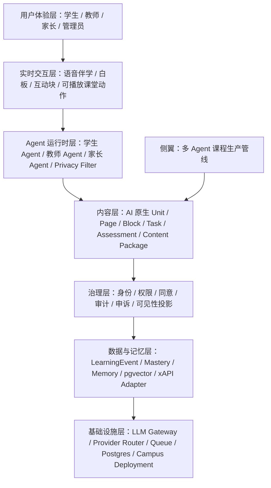

# AI 时代新教育项目总规划重基线

版本：2026-04-26  
状态：外部项目雷达整合后的新版 master plan  
输入依据：

- 既有项目十阶段规划。
- `docs/DEEPTUTOR_INFORMED_PROJECT_PLAN_2026-04-25.md`
- `docs/OPENMAIC_DEEP_DIVE_AND_INTEGRATION_PLAN_2026-04-26.md`
- `docs/GITHUB_EDTECH_REFERENCE_RADAR_2026-04-26.md`
- `docs/UNIT_SPEC.md`
- `docs/REVIEW_AND_SELF_CHECK_PROCESS.md`
- 课程设计提示：`课程设计/AI原生课程设计总提示_OpenMAIC增强版_给新对话.md`

---

## 0. 一句话重定义

这个项目不应被定义为“AI tutor”或“AI 教育工具”。它应被定义为：

> 面向真实学校长期运行的 AI 原生学习操作系统：用 AI 原生教材驱动学生长期伴学，用教师 Agent 放大老师判断力，用家长/治理闭环保护未成年人数据，用事件溯源和可审查内容管线支撑一个可验证、可复制的新教育范式。

我们的护城河不是单点能力，而是四个系统的耦合：

1. 长期学生记忆与学习画像。
2. AI 原生课程内容与可运行 Page/Block/Action。
3. 教师/家长/管理员的隐私安全闭环。
4. 学校级部署、审计、评估和复制能力。

---

## 1. 外部项目带来的战略修正

### 1.1 OpenMAIC 带来的修正

OpenMAIC 证明“多 Agent 课堂 + 语音 + 白板 + PBL + 可播放动作层”已经存在原型。因此，“能语音问答”不是唯一差异化。

我们要把优势上移：

1. 从按钮式语音升级为长期实时语音伴学。
2. 从一次性课堂生成升级为长期课程资产生产。
3. 从 AI 课堂体验升级为学校治理闭环。
4. 从 AI 输出内容升级为可审查、可回滚、可追溯的内容管线。

### 1.2 DeepTutor 带来的修正

DeepTutor 提醒我们：Agent runtime 不应是散 prompt；教材也不应只是 `unit.yaml` 文档。必须下钻到：

```text
Unit -> Page -> Block -> Runtime Event -> Progress / Evidence
```

因此 Phase 2 的核心不再只是“生成 unit.yaml”，而是“生成可运行课程对象”。

### 1.3 Oppia 带来的修正

Oppia 的价值在于 learner-centered exploration。AI 原生教材不能只线性播放 Page/Block，还要设计：

1. 学生回答。
2. 误区识别。
3. 分支反馈。
4. 重新尝试。
5. 学习证据沉淀。

这意味着未来 Unit Spec 要增加或预留 `misconception_feedback_routes`。

### 1.4 Kolibri 带来的修正

学校落地不能假设公网稳定。课程包、媒体、互动块、教师手册、无 AI 任务必须能离线或校园内网可用。

因此需要新增：

```text
Campus Content Channel
Content Package Manifest
Offline Degradation Mode
```

### 1.5 H5P / Lumi 带来的修正

互动内容类型不应无限自由生成。我们需要标准化互动块能力：

1. 选择。
2. 排序。
3. 拖拽。
4. 热点。
5. 分支场景。
6. 仿真。
7. 测验。
8. 口头解释。

这不意味着引入 H5P runtime，而是要设计 H5P-compatible thinking。

### 1.6 LiveKit / Pipecat 带来的修正

实时语音伴学需要独立 voice runtime。按钮录音、上传转文字、再返回文本，不足以支撑“像真人一样伴学”。

未来语音链路应是：

```text
VAD -> STT -> privacy router -> student agent -> TTS -> interruption / barge-in -> LearningEvent
```

### 1.7 Mem0 / Letta 带来的修正

长期记忆不是向量库。它必须是：

1. 可见。
2. 可删。
3. 可解释。
4. 可测试。
5. 可分桶。
6. 可审计。

我们的三桶记忆方向是对的，但需要新增 memory regression 和 transparency gate。

### 1.8 xAPI / LRS 带来的修正

内部事实源仍是 `LearningEvent`。但未来需要外部导出适配：

```text
LearningEvent -> xAPI-like Statement
```

导出必须经过隐私过滤，不能把原始学生对话、情绪内容、家庭信息或教师私密备注带出去。

---

## 2. 新全局架构

### 2.1 七层架构



### 2.2 事实源和派生视图

| 对象 | 事实源 | 派生视图 |
| --- | --- | --- |
| 学习行为 | `LearningEvent` | `MasteryRecord`, `MasteryHistory`, teacher heatmap |
| 对话 | `ConversationTurn` + privacy bucket | student transcript view, teacher-safe signal |
| 记忆 | episodic/semantic memory store | student transparency view, teacher abstract signals |
| 课程内容 | approved `unit.yaml` / content package | frontend Page/Block render model |
| Agent 运行 | `AgentRuntimeEvent` | student timeline, admin audit projection |
| 同意与申诉 | `ConsentRecord`, `AppealTicket` | guardian consent UI, admin queue |
| 内容生产 | review artifact | approved source `unit.yaml` only after explicit apply |

原则：原始事件和物化视图必须分开。老师/家长/外部导出只能看经过投影和隐私过滤的结果。

---

## 3. 新阶段规划

### Phase 0：工程地基

目的：让系统具备可持续开发、可审计、可部署、可验证的基础。

已完成主线：

1. `0.1 shared-types`
2. `0.2 monorepo`
3. `0.3 LLM Gateway`
4. `0.4 memory-store`
5. `0.5 backend skeleton`
6. `0.6 test/CI`

新增 `0.7 外部标准与内容包适配层`

产出：

1. `EXTERNAL_STANDARDS_ADAPTER_SPEC.md`
2. `LearningEvent -> xAPI` 映射草案。
3. `Content Package Manifest` 草案。
4. `H5P compatibility notes`。
5. `Campus Content Channel` 离线/内网内容包策略。

完工指标：

1. 一个示例 `LearningEvent` 可映射为 xAPI-like statement。
2. 一个示例 `unit.yaml` 可导出 content package manifest。
3. 明确不可导出字段清单。
4. 不引入任何外部 runtime 作为强依赖。

复查重点：

1. 外部导出不得绕过隐私过滤。
2. content package 不能包含真实学生数据。
3. H5P 只做兼容思路，不作为首版硬依赖。

### Phase 1：学生 Agent MVP

目的：做出第一个真正能长期陪伴学生的 AI 学伴。

既有子阶段保留：

1. `1.1 persona`
2. `1.2 memory runtime`
3. `1.3 knowledge graph`
4. `1.4 mastery evaluation`
5. `1.5 dialogue modes`
6. `1.6 privacy/emotion routing`
7. `1.7 student dialogue UI`
8. `1.8 internal testing`

新增 `1.7B 实时语音伴学 Spike`

产出：

1. `VOICE_RUNTIME_SPIKE_SPEC.md`
2. LiveKit / Pipecat / native browser + provider streaming 的对比。
3. VAD/STT/TTS/interrupt/privacy router 的最小链路图。
4. `VoiceTurn -> ConversationTurn -> LearningEvent` 映射。

完工指标：

1. 不使用真实学生数据的 POC 可跑通一次语音回合。
2. 学生可打断 AI。
3. 语音 turn 可变成安全学习事件。
4. 敏感内容命中后进入 campus_local_only。
5. 教师侧只能看到安全摘要。

复查重点：

1. 不把音频原文默认给教师/家长。
2. 语音 provider 不接收高敏数据。
3. 低延迟目标、失败降级和成本追踪明确。

### Phase 2：AI 原生课程生产管线

目的：从教材/课标/教师经验生成可运行、可审查、可迭代的 AI 原生课程单元。

当前已完成或推进：

1. Unit Spec。
2. 六角色 Agent workflow。
3. schema + semantic validation。
4. provider execution review artifact。
5. runtime_content Page/Block。
6. AgentRuntimeEvent。

新增重点：

1. `misconception_feedback_routes`
2. `classroom_action_plan`
3. `voice_script`
4. `whiteboard_action_plan`
5. `pbl_issueboard`
6. `learning_task_evidence_plan`
7. `content_package_manifest`

Agent 分工策略：

1. 短期继续 Option A：`engineering_agent` 负责 `implementation + runtime_content`。
2. 当一个单元同时需要语音、白板、PBL、互动模拟、复杂能力认证中的 3 项以上，升级 Option B：新增 `experience_planner_agent`。

完工指标：

1. 一个初二数学单元拥有完整 `metadata/knowledge/pedagogy/narrative/implementation/runtime_content/assessment/quality`。
2. 每个核心知识节点有至少一个可渲染 block。
3. 每个关键误区有反馈路径。
4. 每个 assessment item 可映射到学习任务或能力认证证据。
5. 每个 block 有 `visibility_scope`、`privacy_level`、`source_trace`、`sandbox`。

复查重点：

1. 不允许 Agent 越权写 section。
2. 不允许 blocked artifact 自动 approve。
3. 不允许真实 provider 结果直接写回源 `unit.yaml`。
4. 不允许用国外标准替代中国课标。

### Phase 3：第一批 AI 原生单元生产

目的：从“能产一个”到“能产一个学期的 80% 内容”。

新增要求：

1. 每个单元产出 `unit.yaml`。
2. 每个单元产出 `content_package_manifest.json`。
3. 每个单元有学生侧 Page/Block。
4. 每个单元有教师侧教案和课堂脚本。
5. 每个单元有无 AI 基线和能力认证任务包。
6. 每个单元有离线降级说明。

完工指标：

1. 初二数学一个学期 80% 内容覆盖。
2. 至少 3 个单元能在学生端渲染。
3. 至少 1 个单元能演示语音/白板/PBL 中任意一种增强体验。
4. 至少 1 个单元能生成 teacher dashboard 安全摘要。

复查重点：

1. 单元间知识节点和 prerequisites 不冲突。
2. 课程风格一致。
3. 误区库可复用。
4. 内容包不含真实学生数据。

### Phase 4：教师 Agent 与信号闭环

目的：让老师每天愿意打开系统，并感觉自己被放大，而不是被替代。

核心能力：

1. 班级知识热力。
2. 每日班级日报。
3. 重点学生信号。
4. 干预建议。
5. 干预确认与追踪。
6. 教师对 AI 课程动作的控制权。

新增要求：

1. 教师可预览 AI 课堂动作计划。
2. 教师可暂停/跳过/修改 AI 互动环节。
3. 教师看不到学生原始对话和情绪原文。
4. 教师能看到建议依据链。

完工指标：

1. 3+ 干预流程可跑通。
2. 教师日报可被种子老师确认有价值。
3. Agent 间通讯 0 隐私泄漏。
4. 教师控制台完成 80% 日常工作。

### Phase 5：家长 Agent 与家校闭环

目的：让家长安心，而不是让家长控制。

核心能力：

1. 周报。
2. 重要事件通知。
3. 同意书管理。
4. 申诉入口。
5. 家庭支持建议。

新增要求：

1. 家长不看对话原文。
2. 家长不看情绪细节。
3. 家长不看排名和实时监控。
4. 家长能理解“孩子如何学习”，而不是只看分数。

完工指标：

1. 家长周报打开率目标 > 80%。
2. 申诉流程端到端通畅。
3. 种子家长确认“读完更想和孩子聊天，而不是检查孩子”。

### Phase 6：真实用户体验打磨

目的：从能用到愿意用。

新增重点：

1. 学生学习 workspace，而非单聊天框。
2. 实时语音伴学 UI。
3. AI 课堂动作播放、暂停、中断、恢复。
4. 移动端和教室平板适配。
5. 弱网和离线降级。
6. 无障碍和色弱友好。

完工指标：

1. 5 个学生连续使用 3 天无严重体验问题。
2. 首次进入到第一次有意义互动 < 3 分钟。
3. 老师能无培训或低培训跑完一节课。

### Phase 7：治理层与运行时合并

目的：治理不是管理员后台里的装饰，而是每一次学习、干预、申诉、导出、模型调用都要经过的运行时边界。

新增重点：

1. 运行时置信度门禁。
2. 学习事件审计。
3. xAPI / content package 导出隐私过滤。
4. 语音事件和音频保留策略。
5. 外部 provider 调用可审计。

完工指标：

1. 所有关键操作有审计链。
2. 外部导出不含敏感原文。
3. 外部渗透测试通过。

### Phase 8：Pilot 学校部署

目的：在真实学校跑一个学期，证明产品、内容、治理、教学效果都成立。

新增重点：

1. Campus Content Channel。
2. 校园内网课程包。
3. 弱网模式。
4. 云 provider 不可用时的降级教学流程。
5. 教师培训课程化。
6. 家长沟通模板。

完工指标：

1. 实验班完整运行一个学期。
2. 学生留存率 > 80%。
3. 老师每日使用。
4. 家长周报打开率 > 80%。
5. 0 起未处理重大隐私/安全事件。
6. 有可对外展示效果报告初稿。

### Phase 9：效果验证与第二校扩展

目的：把第一所学校经验产品化，降低第二所学校落地成本。

新增重点：

1. 效果报告学术版和商业版。
2. 内容包复制机制。
3. 学校入驻手册。
4. 教师培训课程。
5. 第二校 LOI。

完工指标：

1. 对外可发布效果报告完成。
2. 第二校 LOI 签署。
3. 产品化文档齐备。
4. 第二校启动计划就绪。

---

## 4. 新增横切能力清单

### 4.1 Voice Runtime

不是按钮录音，而是实时伴学语音会话。

关键对象：

1. `VoiceSession`
2. `VoiceTurn`
3. `SpeechPrivacyRoute`
4. `OralExplanationEvidence`
5. `VoiceProviderPolicy`

### 4.2 Content Package

课程单元不仅是 `unit.yaml`，还应可打包。

关键对象：

1. `content_package_manifest.json`
2. media asset manifest
3. interactive block manifest
4. offline fallback manifest
5. source trace manifest

### 4.3 Misconception Feedback Graph

借鉴 Oppia，关键误区要有反馈路径。

关键对象：

1. `misconception_id`
2. `trigger_signal`
3. `feedback_move`
4. `retry_prompt`
5. `teacher_signal`

### 4.4 Classroom Action Plan

借鉴 OpenMAIC，AI 课堂不是只说话，而是做动作。

关键对象：

1. speech segment
2. block focus
3. whiteboard action
4. interactive start
5. discussion trigger
6. pbl issue opened
7. quiz prompt

### 4.5 External Standards Adapter

不把外部标准变成主架构，但要能导出和兼容。

关键对象：

1. xAPI statement adapter
2. H5P compatibility map
3. content package adapter
4. LMS import/export boundary

### 4.6 Memory Evaluation

长期记忆要测试，不只是实现。

关键对象：

1. correct recall case
2. wrong-student leakage case
3. stale memory case
4. deletion honored case
5. emotional bucket isolation case

---

## 5. 未来 30 天建议路线

### Week 1：重基线收口

1. 完成 `EXTERNAL_STANDARDS_ADAPTER_SPEC.md`。
2. 完成 `VOICE_RUNTIME_SPIKE_SPEC.md`。
3. 完成 `CURRICULUM_DESIGN_IMPORT_CONTRACT.md`。
4. 更新 `UNIT_SPEC.md`，只加入未来扩展说明，不立即改 schema。
5. 写 `CONTENT_PACKAGE_MANIFEST_SPEC.md` 草案。

### Week 2：Phase 2 课程对象增强

1. 设计 `misconception_feedback_routes` 文档。
2. 设计 `classroom_action_plan` 文档。
3. 扩展 sample unit 的非生产草案。
4. 扩展 semantic validator 计划。
5. 评估是否需要 Option B 的 `experience_planner_agent`。

### Week 3：语音和内容包 Spike

1. 不消耗真实 provider 的 voice runtime mock。
2. `VoiceTurn -> LearningEvent` mock。
3. `unit.yaml -> content_package_manifest` mock。
4. xAPI-like export mock。

### Week 4：第一个“可运行课程单元”验收

1. 初二数学一次函数单元 Page/Block 完整化。
2. 教师侧教案和课堂运行脚本对齐。
3. 学习任务与能力认证对齐。
4. 无 AI 基线任务对齐。
5. 运行 schema + semantic + privacy gate。

---

## 6. 决策点清单

以下事项必须停下来等用户确认：

1. 是否引入任何外部项目代码。
2. 是否接受 AGPL 项目代码进入主仓。
3. 是否消耗真实模型 provider 调用。
4. 是否让 aggregator 处理学生、身份、情绪或真实对话数据。
5. 是否选择 LiveKit / Pipecat 作为生产 voice runtime。
6. 是否新增 `experience_planner_agent`。
7. 是否修改核心 `UnitSpec` schema。
8. 是否写回生产 `unit.yaml`。
9. 是否使用真实学生、教师、家长或学校数据。
10. 是否切换主技术栈。

---

## 7. 当前推荐下一步

不需要用户决策、且价值最高的下一步是：

1. 先写 `EXTERNAL_STANDARDS_ADAPTER_SPEC.md`。
2. 再写 `VOICE_RUNTIME_SPIKE_SPEC.md`。
3. 再写 `CURRICULUM_DESIGN_IMPORT_CONTRACT.md`。

这三份文档会把外部项目雷达转化为工程可执行接口，而不是停留在“参考过很多项目”的认知层。

